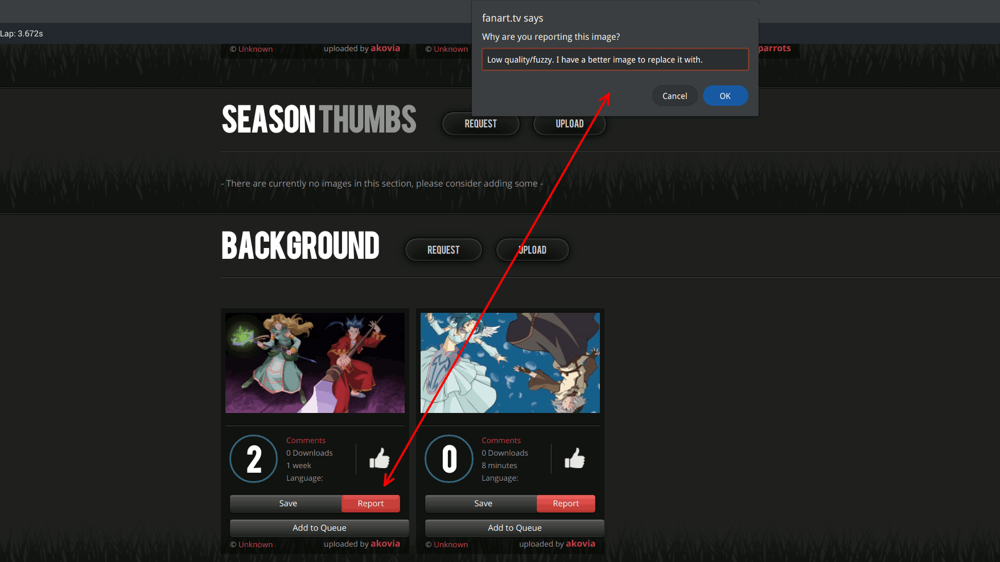
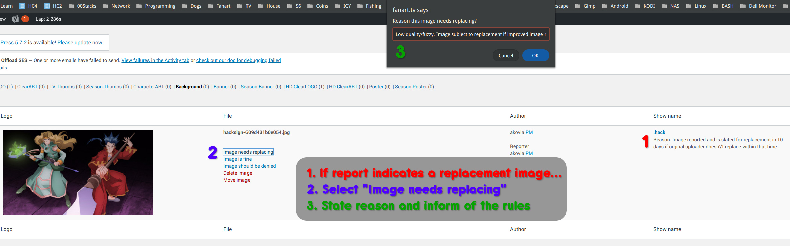
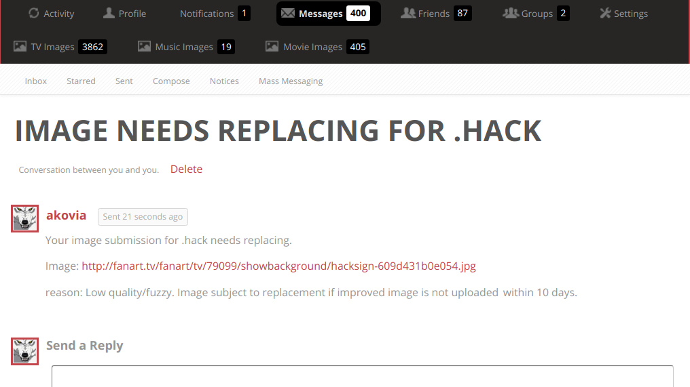
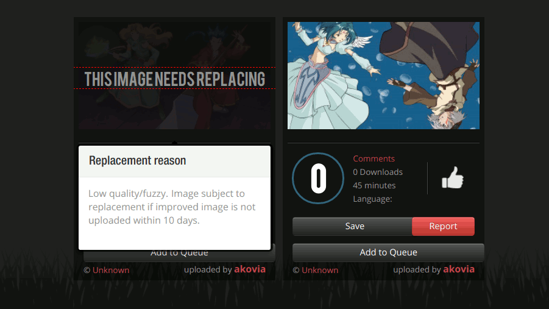
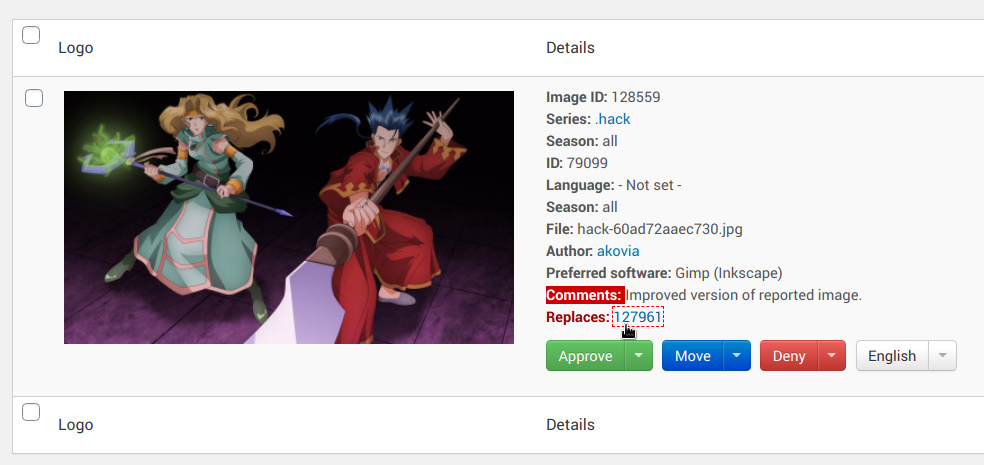

# **How to Replace an Existing Image.**

This is not something that should be taken lightly and **abuse of this system will not be tolerated.** When you are attempting to replace an existing image, you are effectively erasing someone else's hard work. Keep this in mind before requesting a replacement.

We always want the very best images and sometimes new images become available that were not available to the original uploader. Sometimes an image was approved that shouldn't have been. There are many reasons to request to replace an image. Just make sure to follow these rules and there shouldn't be any issues.

The image you submit must be **Instantly** recognizable as a superior image. If you can't meet this requirement, then please don't waste our time or your own. Replacing an image is an involved process and we don't have time to nit-pick tiny imperfections. Submit a fantastic image, and it should be smooth sailing.

Lastly, the original uploader will always get the first crack as replacing their own image with a better one. When an replacement request is submitted, the original uploader will be notified that they have 10 days to submit a replacement. If they meet the requirement, the image will be replaced by them and that will be the end of it.
&nbsp;  
&nbsp;  

## 1.) Report image for replacement.

Reporter waits 10 days before doing anything else to see if image was replaced by original uploader.

 

&nbsp;  
##2.) Moderator gets report and marks image as needing replaced.

&nbsp;  
##3.) This will send a message to the original uploader and give them a chance to respond.

If original uploader submits an improved image within the 10 days, this will conclude the report.

&nbsp;  
##4.) If the original uploader does not respond within 10 days, the reporter can then use the "Replace Image" button to upload his replacement.

&nbsp;  

##5.) Uploader should use the comment section to descibe that this is a replacement.

&nbsp;  

##6.) A moderator can then determine if the uploaded version is worthy to replace the original or not.

If the mod uses Imagus, they can switch back and forth between the two images easily to determine if it’s a superior image.

&nbsp;  

If the reporter can not meet the requirements after one denial, the moderator has the option of removing the “Image needs replacing” tag on the image.