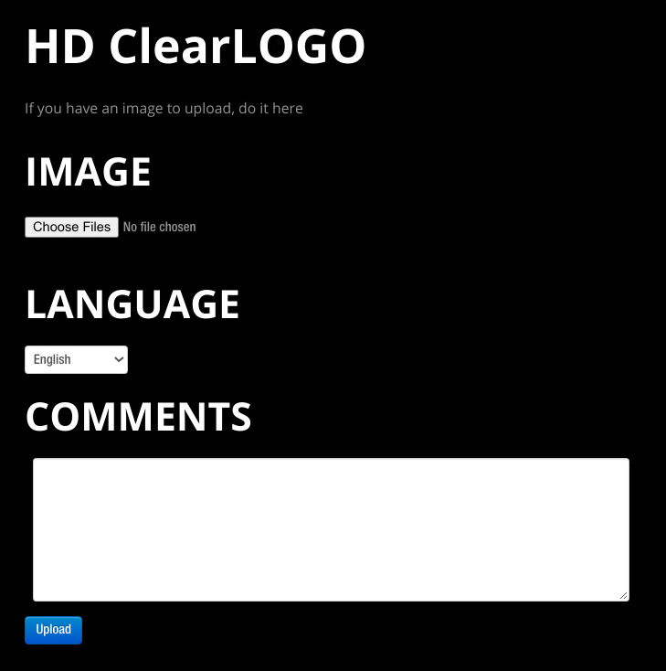
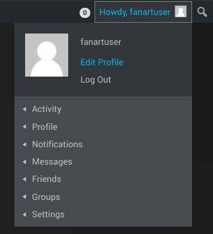
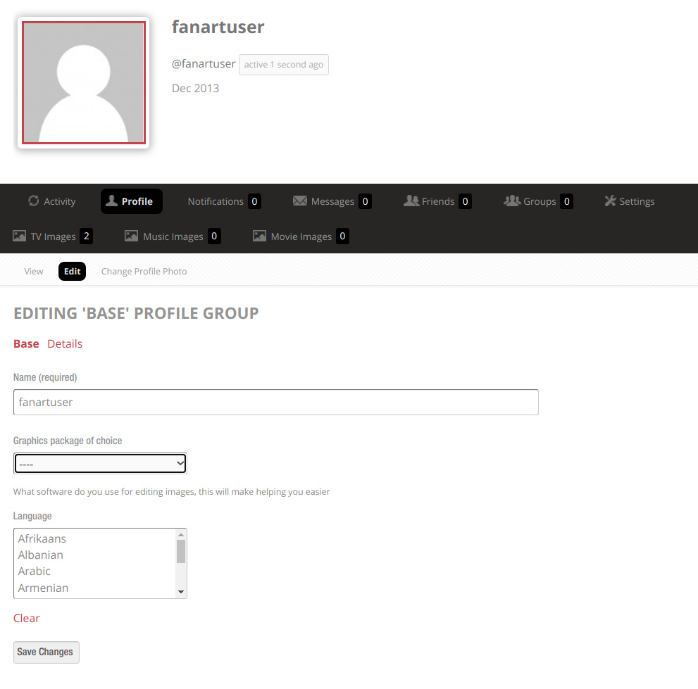

# __Contributor Guide__

Thank you for considering to contribute to Fanart.tv. Please take the time read through this page to save both you and the volunteer staff here time and frustration. 

Knowing the site motto will help to understand the standards we set.

### **No Image is Better Than a Low Quality Image**

---

### __1.) Create Artwork__

We maintain a list of requirements that an image submission must meet in order to be accepted on our site. You can find an overview of these requirements on the main site under each section (Movies /Tv / Music), but the definitive list of requirements is here on the Wiki. Depending on the type of image you are submitting, you should read and understand these requirements or risk having your artwork denied.

??? abstract "Movies"
    - [HD ClearLOGO](../ImageTypes/Movies/hdmovielogo.md)
    - [Poster](../ImageTypes/Movies/movieposter.md)
    - [HD ClearART](../ImageTypes/Movies/hdmovieclearart.md)
    - [cdART](../ImageTypes/Movies/moviedisc.md)
    - [Background](../ImageTypes/Movies/moviebackground.md)
    - [Banner](../ImageTypes/Movies/moviebanner.md)
    - [Thumbs](../ImageTypes/Movies/moviethumb.md)

??? abstract "TV Shows"
    - [TV HD ClearLOGO](../ImageTypes/TV/hdtvlogo.md)
    - [TV Poster](../ImageTypes/TV/tvposter.md)
    - [TV Season Poster](../ImageTypes/TV/seasonposter.md)
    - [TV HD ClearART](../ImageTypes/TV/hdclearart.md)
    - [TV CharacterART](../ImageTypes/TV/characterart.md)
    - [TV Thumbs](../ImageTypes/TV/tvthumb.md)
    - [TV Season Thumbs](../ImageTypes/TV/seasonthumb.md)
    - [TV Background](../ImageTypes/TV/showbackground.md)
    - [TV Banner](../ImageTypes/TV/tvbanner.md)
    - [TV Season Banner](../ImageTypes/TV/seasonbanner.md)
 

??? abstract "Music"
    - [HD ClearLOGO](../ImageTypes/Music/hdmusiclogo.md)
    - [Background](../ImageTypes/Music/artistbackground.md)
    - [cdART](../ImageTypes/Music/cdart.md)
    - [Album Cover](../ImageTypes/Music/albumcover.md)
    - [Artist Thumb](../ImageTypes/Music/artistthumb.md)
    - [Banner](../ImageTypes/Music/musicbanner.md)
    - [Record Label](../ImageTypes/Music/musiclabel.md)

We have a large collection of [tutorials and guides](https://fanart.tv/tutorials/){target=_blank} that are available to help you create high quality artwork that is designed to be accepted to our site. If you need further help, you should check out the [FAQ](faq.md), the guide on [How Fanart.tv works](fanart database.md), or our [Help Guide](fanart help.md).

---

??? warning "Submitting Quality artwork"

    Trying to grind through the missing art in your library may cloud your judgment of what’s good and what’s “good enough“. Uploading every image you make with no interest whether it passes or not, is not acceptable.  

    Try to be confident before uploading so you are not stealing a moderators time and wasting your own. Our site is full of [Tutorials](https://fanart.tv/tutorials/) and other helpful information to help you create quality artwork. 

### __2.) Submit Artwork__

Once you've met all the image requirements and are ready to start uploading, you will need to navigate to the [correct page](fanart database.md#finding-the-right-entry "Make sure you are on the correct page and not a defunct entry") on the site and use the [UPLOAD](#submit-artwork){ .md-button .md-button--primary id='upload'} button for the type of image you are uploading. Depending on the type of image, you will get a different upload dialog that must be read and understood. 

=== "Basic"

    { align=right id='up-image' }

     - _Choose file to submit_
     - _Use the Comments section for copyright information, author attribution, or notes to the moderator if needed._

=== "Basic + Language"

    { align=right id='up-image' }

    - _Same as_ __Basic__
    - _Choose Language_
    - _Textless images must select the _"__None__"_ option_
    - _If no match for language, choose_ "__Unknown__"_ option._

=== "Movie Disc"

    { align=right id='up-image' }

    - _Same as_ __Basic + Language__
    - _Choose Disc Number_
    - _Choose Disc Type_

=== "Season Art"

    { align=right id='up-image' }

    - _Same as_ __Basic + Language__
    - _Choose Season Number_

=== "Music Disc"

    { align=right id='up-image' }

    - _Same as_ __Basic__
    - _Choose Disc Number_

=== "Album Cover"

    { align=right id='up-image' }

    - _Same as_ __Basic__

---

### __3.) Moderation__

If you have gotten this far, your images are now in the hands of our [volunteer moderators](../General/staff.md)

They will inspect each image to determine if it meets all of the technical, and subjective requirements to be added to our library.

??? success

    Your image was approved. :partying_face:

    Your image should show up in the library immediately after moderation. Now everyone (including you) can vote up your image. Increase your voting power by becoming a [VIP](vip.md)

    !!! info
        The image might not be available to the [API](personal api.md) for up to two weeks after it has been approved, but is available for immediate download directly from the site.

??? fail

    Your image was denied. :disappointed:

    You will receive a Private Message on the site and an email with the details of the denial. This is not the end of the world, and you just need to follow the direction of the moderator to get your image approved. It could be a simple technical detail, or it may be a low quality image that has no path to be approved on our site. Either way, the moderator should inform you of what needs to be done.

    It can take some time to get the hang of all the rules, as well as learning how to use your graphics program to achieve the results you want. If you don't get discouraged easily, you will be creating high quality art in no time.

??? tip "Pro Tip"

    #### __Complete Your User Profile__
 
    With this information, moderators can point you to the appropriate [tutorials](https://fanart.tv/tutorials/){target=_blank} for your software, and can speak with your in your native language if we have a [moderator on staff](../General/staff.md) that speaks your language.

    __1.__ Hover over your user avatar in the top right of the page and select "__Edit Profile__"
    
    
    &nbsp;  
    

    __2.__ Select the options from the list.
    

---

### __4.) Other Considerations__

Here you will find other information that does not fit neatly into the other categories, but is relevant information for contributors.

??? info "__Point System__"
    We have a point system that assigns point values to different types of art, and keeps track of the [total amount of points per user](https://fanart.tv/contributors/){target=_blank}.

    This was always meant to be a way to display the hard work our contributors have put into improving the site. It was __never meant to be a competition.__
    
    Unfortunately some people just can't help themselves and feel they must "win" whenever points are involved. This leads to poor quality uploads that actually take away from contributing to the site. First by trying to submit just passable images instead of great images, and it steals the time of our volunteer Moderators. 
    
    Users thought to be engaging in point hunting will kindly be asked to stop, and may be put on probation or even loose uploading privileges. 

??? info "__Voting__"
    We also have a Voting/Like system in place so you can show an artist when you really appreciate their submissions. We encourage people to vote and vote often. This will help the best art on the site     to get recognition and will also inspire the artists to continue contributing to the site.
    
    As happens with any point system, some people feel they must win at votes. There have been many incidents where single users were found using multiple accounts to inflate the vote counts on their own images. This is a violation of [the rules here](../General/site rules.md), and a violation of trust. Artificially inflating votes does nothing to help the site and most of the time hurts the site. Violators will be dealt with     harshly.

??? info "No Good Source Images"

    We understand that sometimes there just aren’t very good sources to work with to make high quality art that will be accepted here. In those cases you should either get very creative and do your best to re-create the art in higher quality, or upload it to one of the many other fanart sites that don’t moderate. Our goal is not to have an image for every single show/movie/album, but to have a Great Image for every single show/movie/album. 
    
    It’s also a good thing to remember that just because an image doesn’t work well for our library here, doesn’t mean you can’t use it in your own media center. If you think your image is perfectly fine for your needs, then you should use it on your system.

