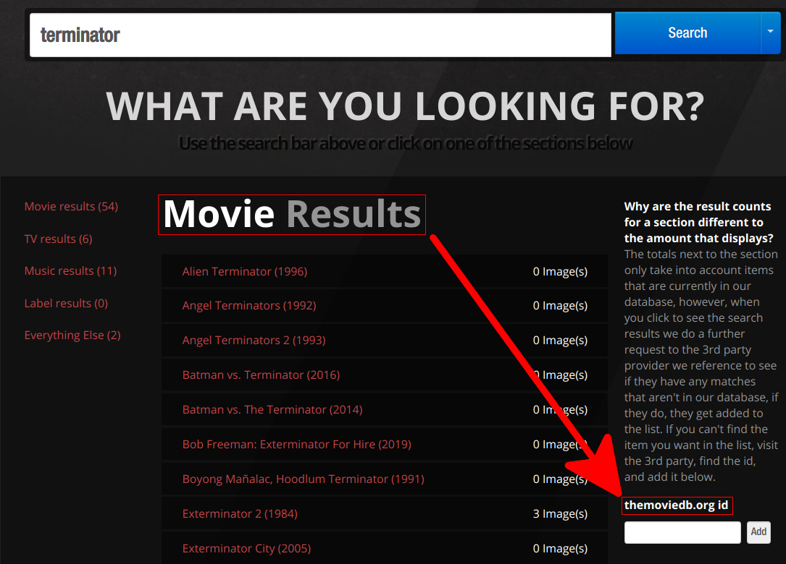
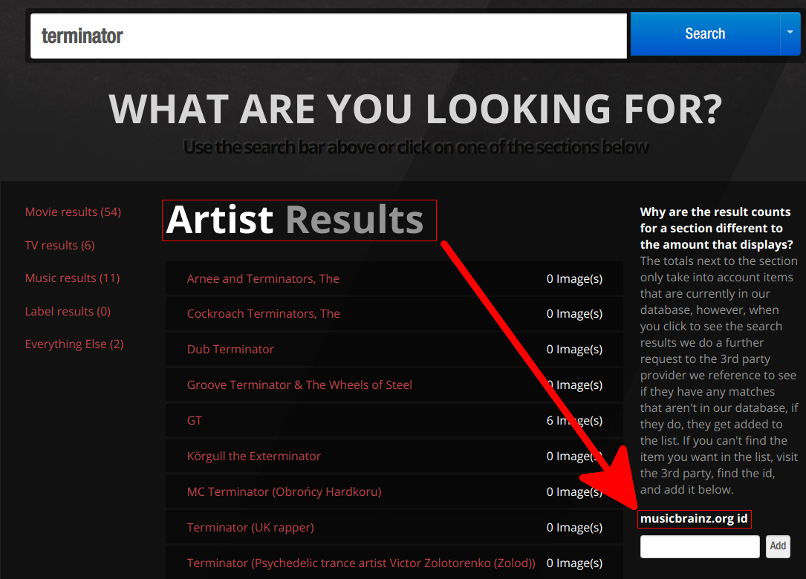
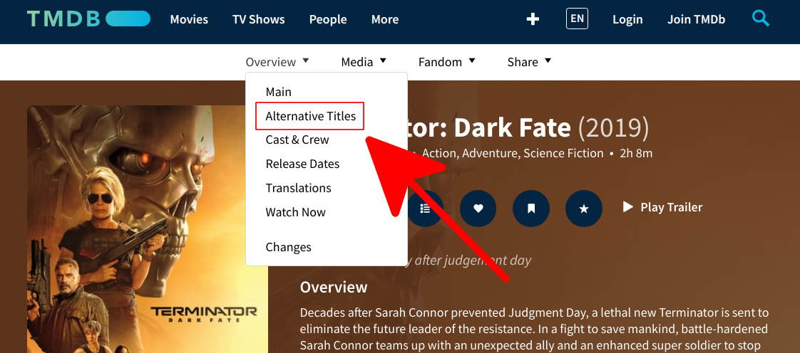
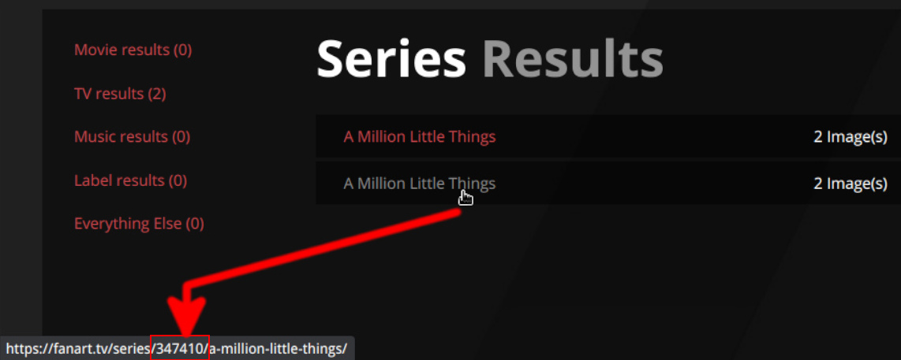
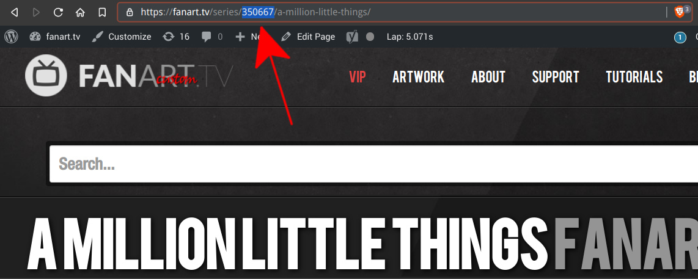

# __HOW FANART.TV WORKS__

Understanding how Fanart.tv works can be very helpful if you are a regular on the site. 

Use the menu on the right to go directly to a section of interest, or just start at the beginning.

--- 

## __Key points to remember__

- Fanart.tv ^^__DOES NOT__^^ keep a database of TV-Shows Movies or Music.
- Fanart.tv ^^__DOES__^^ source this information from other Databases.
- Fanart.tv ^^__DOES__^^ keeps it’s own Database of Images.
- Fanart.tv ^^__DOES NOT__^^ source TV information from TheMovieDB.
- Fanart.tv ^^__DOES NOT__^^ source Movie information from TheTVDB.

--- 

## __The databases we source from__

|Section|Database|Typical ID# example|
|:---|:---|:---|
|__Movies__ |[TheMovieDB.org](https://www.themoviedb.org/){target= blank}|290859|
|__TV-Shows__| [TheTVDB.com](https://thetvdb.com/){target= blank}|80344|
|__Music__| [Musicbrainz.org](https://musicbrainz.org/){target= blank}|95e1ead9-4d31-4808-a7ac-32c3614c116b|

---

## __Finding the right entry__

The glue that makes all this work is the __ID#__ used by each database. 

If you can find the entry[^1] on the site where we get the information from, you can use their ID on _our_ site to go directly to that entry, or [add the entry](#add-missing-entries "Add missing entries") if missing. 

Hover over the images for each of the databases below to recognize where to find the source ID, and where the same ID is on our site. 

=== "TheMovieDB #__290859__"

    

=== "TheTVDB #__80344__"

    

=== "MusicBrainz #__95e1ead9-4d31-4808-a7ac-32c3614c116b__"

    

---

## __Add missing entries__

  If an item has not been added to our database yet, you can add it yourself using one of the following methods.

  1. You can enter the ID in the Search Results page for the proper section.

  1. You can edit the URL directly to enter the ID from the source. _(see the pro tip below)_

=== "Add Movie"

    

=== "Add Show"

    

=== "Add Artist"

    

  

???+ info 

    _Entering an ID that already exists, just takes you to that entry. If you are not comfortable editing URLs, you can use this method to navigate directly to the entry._

??? tip "Pro Tip"
    Anything after the ID# in the URL can safely be ignored.

    __Example:__

      If you use the URL [https://fanart.tv/movie/290859](https://fanart.tv/movie/290859){target= blank} 

      it will fill in the the rest and take you to __https://fanart.tv/movie/290859/terminator-dark-fate/__

---

## __Why any of this matters__

These [source databases](#the-databases-we-source-from "The databases we source from") do not sync with our database whenever they make a change, so entries can become duplicated, orphaned, erased, merged, etc...

Here is a list of some of the issues you may encounter, and how to fix them. 

??? warning "No matches found"

    __Can't find correct result using the fanart.tv site search__

    This can mean many things including miss-typing the title, entering the wrong title, searching in the wrong language, or it hasn't been added to our database yet.

    The fix is to always [locate the title at the source](#finding-the-right-entry "Finding the right entry"), and [enter that ID](#add-missing-entries "Add missing entries") on our site.

??? warning "Wrong Title"

    __Entry is listed with the wrong title even though the ID# is correct.__

    This means the official title was changed ^^after^^ the entry was created on our site. This is a very easy fix. Just ask to have the entry [refreshed](#request-a-refresh "Request a refresh") on [Discord](https://discord.gg/r9VufRk "Fanart.tv Discord server"){target= blank} in the _#issues_ channel.

??? warning "No English title set"

    ??? info "The MovieDB"

        This usually means the movie was never released in the U.S. and doesn't have an English title set. 

        1. First verify if an English title has already been set but hasn't been [refreshed](#request-a-refresh "Request a refresh") on our site. _(see image below)_

        1. If not, the next step is to check [IMDB](http://www.imdb.com/){target= blank} for an English alias. You need to look down the page and find the heading named ^^Details^^. Under that heading you will see a line named ^^Also Known As^^ _(AKA)_. Expand that heading and check for an _English_ or _World-wide_ title. 

        1. The title you find on IMDB, _(if any)_ is what you will enter on TheMovieDB by editing the ^^Translations^^ Section.

        

        - Wait 48 hours after making any edits before requesting the entry be [refreshed](#request-a-refresh "Request a refresh") on our site.

    ??? info "The TVDB"    

        This usually means the show was never released in the U.S. and doesn't have an English title set. 

        1. First verify if an English title has already been set but hasn't been [refreshed](#request-a-refresh "Request a refresh") on our site. _(see image below)_

        1. Follow the directions on [this page](https://support.thetvdb.com/kb/faq.php?id=23 "TV Sources of Truth"){target= blank} to source an English title.

        1. The title you find , _(if any)_ is what you will enter on TheTVDB by [editing](https://support.thetvdb.com/kb/faq.php?id=32 "Editing Unlocked Series"){target= blank} the ^^Edit Translations^^ section. _(must be logged in in to see it)_ 

        

          - Sometimes the series will be locked for various reasons. To have a title changed for a locked series you will need to [make a request](https://support.thetvdb.com/kb/faq.php?id=33 "Requesting Changes to Locked/Certified Series"){target= blank}

          - Wait 48 hours after making any edits before requesting the entry be [refreshed](#request-a-refresh "Request a refresh") on our site.

??? warning "Duplicate Entries"

    There will be times when you will find duplicated entries when searching the site. 

    When this happens you will need to know which is the valid entry to submit to, and will need to notify a moderator on [Discord](https://discord.gg/r9VufRk "Fanart.tv Discord server"){target= blank} in the _#issues_ channel so they can [merge the duplicates into one.](#merging-duplicate-entries "Merging duplicate entries")

    You should also look through both entries so you don't [submit art that already exists](#proper-way-to-make-submissions "Proper way to make submissions"). 
    
     ---

    Find the ID of each duplicate by hovering over the links in the search results, or by going to each result and looking at the URL.

    === "Hover the Title"

        
    
    === "Go to Title"

        

      Use those IDs to [find the valid entry](#finding-the-right-entry "Finding the right entry") at the source database.

---

## __Proper way to make submissions__

If you do not want to risk having your perfectly good artwork denied later on because the same artwork already exists in an orphaned entry, please ^^Make Sure...^^ 

  1. __You are uploading to the [correct entry](#finding-the-right-entry "Finding the right entry")__
      - Always find the ID at the source and use that to verify the correct entry on our site.

  1. __There are not any orphaned entries on our site already.__
      - Try using our search for similar titles. Use broad search terms and scan the results for any possible matches.

  1. __Report any issues found__
      - Please notify a moderator when you find any issues on [Discord](https://discord.gg/r9VufRk "Fanart.tv Discord server"){target= blank} in the _#issues_ channel

---

## __Request a refresh__

  The sites we source our information from are constantly updating their own information. When they change something in their databases, it doesn’t get propagated to our own site unless we make a new request for that information. _(ie.. refresh our info)_ 

  The preferred way to request a refresh is to ask on [Discord](https://discord.gg/r9VufRk "Fanart.tv Discord server"){target= blank} in the _#issues_ channel.

  You can also use the [Housekeeping](https://forum.fanart.tv/viewforum.php?f=31){target= blank} section of the [forums](https://forum.fanart.tv/index.php){target= blank} if you prefer.

  __Always__ paste a link to the entry to be refreshed, and state the reason for the refresh so the moderator can confirm the desired changes were made.

??? warning "Wait 48 hours after making edits on a source site before requesting a refresh."
  
    It typically takes that long before the information is available to us to be refreshed. Asking any sooner than that is just wasting a moderators time and is not advised.

---

## __Merging duplicate entries__

  Sometimes it's unavoidable and we have to merge multiple entries into one. This happens on the [source db sites](#the-databases-we-source-from) when they update their databases for [many reasons.](https://forums.thetvdb.com/search.php?keywords=merge+entries&terms=all&submit=Search "Some TVDB examples"){target= blank}

  The fallout on our site, is that sometimes we have duplicate artwork that both users submitted to valid entries. The best way to avoid this for yourself is to learn the [proper way to make submissions.](#proper-way-to-make-submissions) 

  When this does happen, we employ a few rules to be as fair as possible.

   - All things being equal, the oldest submission is kept.
   
   - If the newer submission is instantly recognizable as a superior image, it is kept instead.

   - Moderator decisions are final.

---

## __Tips on editing the source__

Each site we source from are community driven sites like our own and rely on users like you to help maintain those databases accurately. We encourage you to create accounts on those sites so errors can be fixed when you spot them. 

The following resources should help you get started. 

??? info "[MUSICBRAINZ.ORG](http://musicbrainz.org/){target= blank}"

    [The MusicBrainz Beginners Guide](https://musicbrainz.org/doc/Beginners_Guide){target= blank}

    We also have a tutorial [here](https://fanart.tv/tutorials/add-album-database/){target= blank} on how to Add an Album to the Database.

    This can help if you can’t find the album already listed on our site, and can help to understand MusicBrainz in general.

??? info "[THEMOVIEDB.ORG](https://www.themoviedb.org/){target= blank}"

    [The MovieDB Contribution Bible](https://www.themoviedb.org/bible/general){target= blank}

??? info "[THETVDB.COM](http://thetvdb.com/){target= blank}"

    [The TVDB Contribution Bible](https://support.thetvdb.com/kb/faq.php?cid=4){target= blank}

[^1]:
    The term "Entry" is used to identify any type of record in our, or any other database interchangeably. So an entry could be The Terminator Movie on our site, or The Beatles on the MusicBrainz site.

