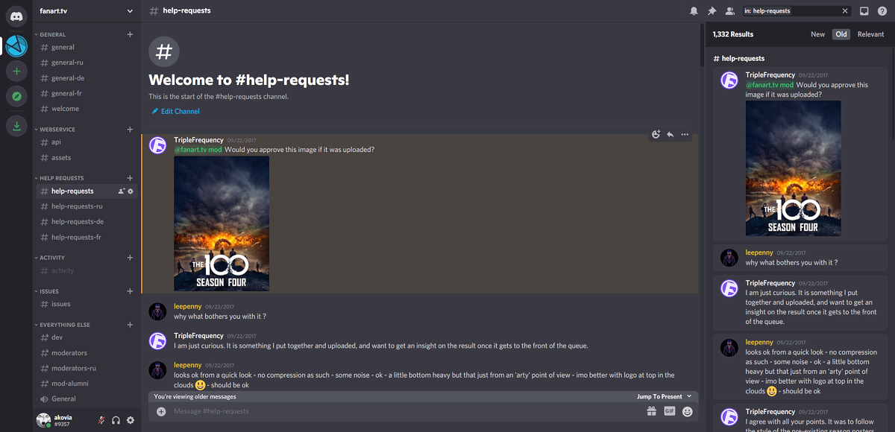
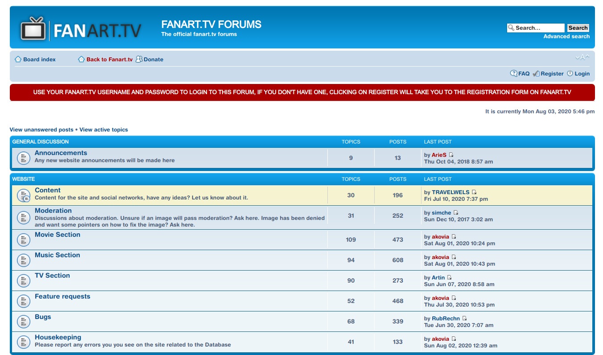

# __Fanart Help__

Fanart.tv has a lot of resources available to help with just about anything. 

Use this list to find the best place to get help.

- __[DISCORD](fanart help.md#discord-server)__
- __[TUTORIALS](fanart help.md#tutorials)__
- __[FORUMS](fanart help.md#forums)__
- __[OTHER](fanart help.md#other)__

---

### __DISCORD SERVER__

BEST FOR:

- __General Help__
- __Quick Responses__

Discord is our live chat server. It’s a bit like IRC (Internet Relay Chat) on steroids.

There are many different channels on the server, so try to make sure you are posting in the proper channel to give you the best chance to have your question answered.

If someone is in the channel, you will most likely get an answer right away. If you need help with Discord itself, there is a big :fontawesome-solid-circle-question: in the top right-hand corner of the screen that will take you to the Discord help center.

[Go there now..](https://discord.gg/r9VufRk){target= blank}

---

### __TUTORIALS__

BEST FOR:

- __In-Depth Guides__
- __Fanart Creation__
- __Software Support__
- __For those who like to help themselves before asking for a hand, the Tutorial Section should be your first stop.__

Make sure to use the Category and Application filters in the Side-Bar to quickly find the content you are looking for.

[Go there now..](https://fanart.tv/tutorials/){target= blank}

---

### __FORUMS__

BEST FOR:

- __Reference Material__
- __Archived Discussions__
- __Graphics Program Guides__

The forums are no longer open to new registrations, but are still available as an archive reference. There is still a wealth of information avialable from years of contributions. You can browse or search to find useful information.

[Go there now..](https://forum.fanart.tv/index.php?){target= blank}

---

### __OTHER__

Here are a few of our most popular and useful help resources.

- [Getting Started](getting started.md)
- Navigating Fanart.tv
- [How Fanart.tv works](fanart database.md)
- [Why your art may be denied](https://fanart.tv/tutorials/artwork-may-denied/){target= blank}
- How to search for images
- [Templates for Images](https://fanart.tv/tutorials/templates/){target= blank}