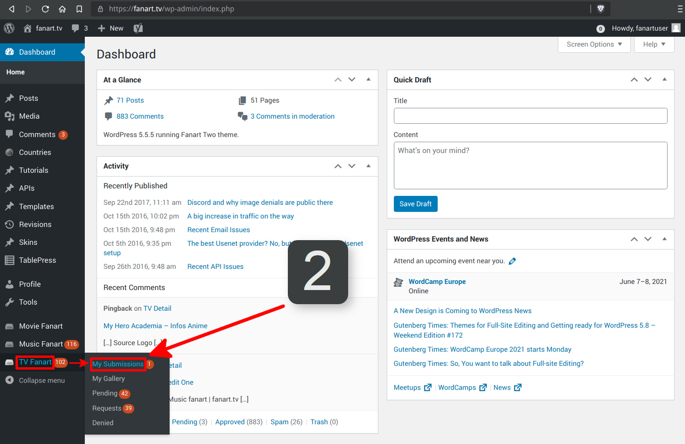

# __How to retract a submission before moderation__

You might notice a mistake in your submission and want to replace it before it gets moderated.

Follow this guide to remove your own submissions.

=== "1- Dashboard"

    You can use the [dashboard link](http://fanart.tv/wp-admin/) under the gauge logo at the top left of every page.

    

=== "2- My Submissions"

    Navigate to the proper section on the left menu. _(Movie Fanart / Music Fanart / TV Fanart)_

    

=== "3- Image Type"

    From here you select the proper section from the menu across the top.

    

=== "4- Delete"

    Now hover over the image and the Delete button will appear. Use it to delete the image

    

!!! note

    Once an image has been moderated, it can only be deleted or updated by a moderator.

    If you notice a mistake that a moderator has missed, you can use the [Report Image](#){ .md-button .md-button--primary id='report'} button under every image on the site.