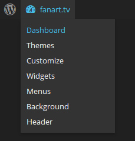
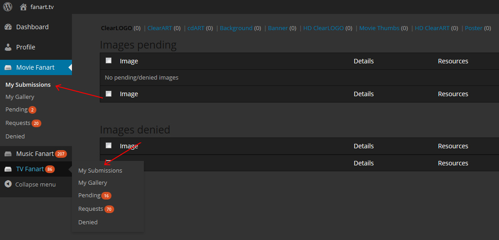

# __How to retract a submission before moderation__

You can use the [dashboard link](http://fanart.tv/wp-admin/) under the gauge logo at the top left of every page.

Navigate to the proper section on the left menu, (Movie Fanart / Music Fanart / TV Fanart) then select the the “My Submissions” Sub-Menu.

From here you select the proper section from the menu across the top and then you can Delete submissions.

!!! note

    Once an image has been moderated, it can only be deleted or updated by a moderator.

    If you notice a mistake that a moderator has missed, you can use the [Report Image](#){ .md-button .md-button--primary id='report'} button under every image on the site.