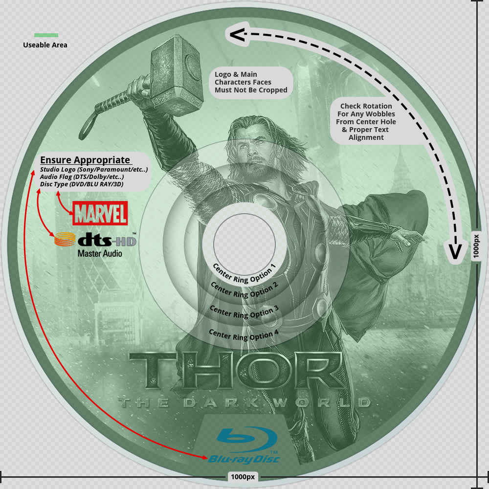

!!! info "Overview"

    - __cdArts are the original movie discs with a transparent background__
    - __Can be used while browsing your media centre library to show the original disc next to the cover__
    - __Can be used as a while playing the movie in a mediacentre__

---

#### **Rules Synopsis**

- Images must be in png format sized 1000x1000 pixels, no exceptions.
- The cdART template must be used for consistency
- Outside areas and middle must be transparent
- Split rings must be used when necessary
- Images must be rotated so that the text is upright
- No usernames or designer names are permitted
- Only high quality images will be accepted
- Size limit is max. 1.25Mb. Please try to make them as small as possible
- Title of movie & faces cannot be cropped by the middle hole on custom discs
- Custom discs need to include a studio logo, audio flag, and disc type flag. (DVD/Blu Ray/3D/UltraHD Bluray)
- A limit of 4 cdARTs per movie per user. No Exceptions.
- UHD Bluray type discs require a link to the entry on [blue-ray.com](https://www.blu-ray.com/)
- An image can only be used once per language per individual
 
---

---

#### __Other rules and considerations__

??? info "**Similar Images**"  

    - __Each image should be it’s own unique piece of art. __

    - __Do not submit art that is similar to art already on the site, or to your own submissions. __

    - __This includes different zoom levels of the same image, and using different logo combinations with the same images.__

    - __The only exception is the 2 language rule.__
    

??? info "**Languages**"

    - __Each user is limited to creating a piece of art in a maximum of 2 languages.__

    - __The most prominent language in the logo is what determines what language to set.__

    - __If the title of a Movie/TV Show is identical in any country to the title in English, the image MUST be uploaded as English. It is your responsibility to check [imdb](http://www.imdb.com/) or [tvdb](http://thetvdb.com/) before you upload it.__

    English is the default language as well as the fallback language in Media Centers, this will ensure the artwork is available to the widest audience possible. When we move to the new site, we will have an option to set a piece of art to multiple languages which will make this rule obsolete, but until then please observe this rule.

    We really don’t want to swamp our database with a zillion images in every possible language/format that exists. If there is an interest for some art in a language that is not available, it will prompt that user to either create that artwork themselves, or they can use the request system. This way only images that are in demand are getting produced, and we are not filling up our pages with art gathering dust.  
    
    Our goal should be to try and fill in or make artwork where there is none. This is much more helpful to the site. One look at our [Incomplete Section](https://fanart.tv/list-page/) should give plenty of opportunities for people who want to produce a lot of art and want to really help the site at the same time.

??? info "**Collection Art**"
    - __Collection art should reflect characters or elements that were in all the movies.__

    The idea of collection art is to represent the entire collection, and not just one movie. This can be difficult sometimes but creativity should win out in the end if the effort is there. In the case where the main actor has changed, you could have all the main role actors in the same poster/clearart/banner etc. Or even an element that spans all the movies. Point is, if you make an art with a main character and a villain from a single movie, then that should be used for that movie and not as collection art.

??? info "**CdArt Cropping**"
    - __No cropping of text by disc edge or center hole (titles/flags/actors etc)__
 
    If using characters from movie on custom disc art – do not crop their faces over center hole.  
    
    Partial cropping may be allowed but is at the moderators discretion. 

#### __Resources__

??? example "Movie Disc Templates and Tutorials"

    - [Why Your Artwork May Be Denied](/General/why denied/)
    - [Gimp Movie Disc Template](https://github.com/fanart-tv/templates/raw/main/Gimp/Gimp_cdArt_Template-v4_2022.xcf){target= blank}
    - [Photoshop Movie Disc Template](https://github.com/fanart-tv/templates/raw/main/Photoshop/Photoshop_cdArt_Template-v5_2023.psd){target= blank}
    - [Corel Movie Disc Template](https://github.com/fanart-tv/templates/raw/main/Corel/Corel_cdArt_Template_2022.pspimage){target= blank}
    - [Movie Disc Tutorials](https://fanart.tv/type/cdart-2/){target= blank}
    
    