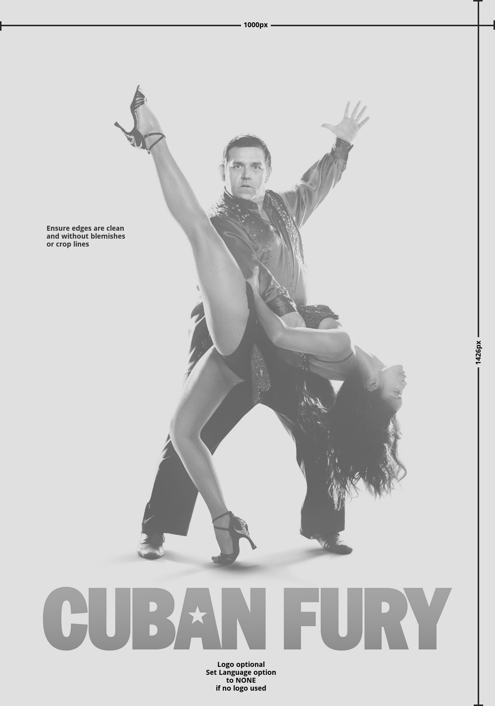

!!! info "Overview"

    - Movie Posters are images of a movie depicting its media cover or optionally a custom textless version depicting the movie.
    - Can be used while browsing your media center library as a recognizable navigation item.

---

#### **Rules Synopsis**

* Images must be in jpg format sized 1000x1426 pixels
* Only high quality images will be accepted. No Exceptions.
* Stock covers are preferred if the unpermitted elements (small, illegible text; release dates, …) are removed.
* Posters should represent the media cover when possible. Custom covers are not discouraged but plain or portrait type images are.
* Posters should contain images of character(s) or highly recognizable major items from the movie 
* Posters can be textless or include a logo (no exceptions, no other text is allowed)
* Editions: 3D, Extended Cut, Final Cut, Directors Cut, etc can be used only if it is an official studio release (If you can buy it in a store, you can use it)
* Language for Textless Posters needs to be set to None, no exceptions
* Images should not have borders or frames unless it is true to the original
* A limit of 4 posters per show/movie per user. This can be any combination of text/textless. No Exceptions

&nbsp;

---

#### __Other rules and considerations__

??? note "**Similar Images**"  

    - __Each image should be it’s own unique piece of art. __

    - __Do not submit art that is similar to art already on the site, or to your own submissions. __

    - __This includes different zoom levels of the same image, and using different logo combinations with the same images.__

    - __The only exception is the 2 language rule.__
    

??? note "**Languages**"

    - __Each user is limited to creating a piece of art in a maximum of 2 languages.__

    - __If the title of a Movie/TV Show is identical in any country to the title in English, the image MUST be uploaded as English. It is your responsibility to check [imdb](http://www.imdb.com/) or [tvdb](http://thetvdb.com/) before you upload it.__

    English is the default language as well as the fallback language in Media Centers, this will ensure the artwork is available to the widest audience possible. When we move to the new site, we will have an option to set a piece of art to multiple languages which will make this rule obsolete, but until then please observe this rule.

    We really don’t want to swamp our database with a zillion images in every possible language/format that exists. If there is an interest for some art in a language that is not available, it will prompt that user to either create that artwork themselves, or they can use the request system. This way only images that are in demand are getting produced, and we are not filling up our pages with art gathering dust.  
    
    Our goal should be to try and fill in or make artwork where there is none. This is much more helpful to the site. One look at our [Incomplete Section](https://fanart.tv/list-page/) should give plenty of opportunities for people who want to produce a lot of art and want to really help the site at the same time.
    

??? note "**Collection Art**"
    - __Collection art should reflect characters or elements that were in all the movies.__

    The idea of collection art is to represent the entire collection, and not just one movie. This can be difficult sometimes but creativity should win out in the end if the effort is there. In the case where the main actor has changed, you could have all the main role actors in the same poster/clearart/banner etc. Or even an element that spans all the movies. Point is, if you make an art with a main character and a villain from a single movie, then that should be used for that movie and not as collection art.

??? note "**Custom Posters**"

    Official posters that have been cleaned of prohibited elements will always be preferred over [custom posters](https://forum.fanart.tv/viewtopic.php?f=15&t=13). Most people will associate these images with the DVD/Blu-ray cases in their own libraries.

    Custom posters are allowed, but must meet certain requirements.

    - __Is this something I would see on a store shelf somewhere?__
    - __Does this really represent the movie/series in an identifiable way?__
    - __Is my source material good enough to be considered“HighQuality”?__
    - __Would I consider this poster to be my one and only poster for this movie/series?__
    - __Would this poster be considered a [Portrait](https://forum.fanart.tv/viewtopic.php?f=15&t=13) type cover?__

    There may not be a clear way to define an acceptable custom poster, but try to imagine the poster you are submitting being displayed on a DVD case in a store on a shelf somewhere. 

    Can you see it? 

    If not, it’s probably not fitting for this section either.
