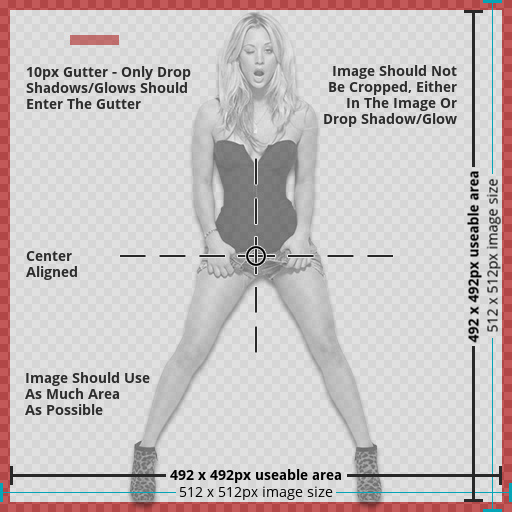

!!! info "Overview"

    - TV Show CharacterArts are images of a tvshow characters or recognizable object of the TV Show with a transparent background
    - Can be used while browsing your media center library to show next to the poster/banner or as a recognizable navigation item

---

#### **Rules Synopsis**

- 512x512px transparent PNG image
- center-aligned with the image being at least the full width or height (512px minus gutter) depending on orientation of the original source image
- 2px drop shadow with a 90 degree angle from the top optional (this would have to discussed further as there are inherit benefits to having drop shadow vs not having one)
- Character(s) or item(s) need to be highly recognizable from the tvshow. No major obstructions or props will be allowed in the pictures along with them.
- Character(s) or item(s) need to be fully visible. No cropping allowed
- 10px gutter. A gutter is an area around the image's edges where the image shouldn\'t overlap. It\'s used for things like drop shadows where they would extend beyond that line. Using this technique allows for bleeding and makes for a properly uniform image.
- A limit of 4 characterarts per show per user. No duplicate images used between character images and multi-character images.

---

#### __Other rules and considerations__

??? note "**Similar Images**"  

    - __Each image should be it’s own unique piece of art. __

    - __Do not submit art that is similar to art already on the site, or to your own submissions. __

#### __Resources__

??? example "CharacterArt Templates and Tutorials"

    - [Why Your Artwork May Be Denied](/General/why denied/)
    - [Gimp CharacterArt Template](https://fanart.tv/wp-content/uploads/2021/06/HDcharacterart-Template_2021.xcf){target= blank}
    - Photoshop CharacterArt Template
    - [CharacterArt Tutorials](https://fanart.tv/type/characterart/){target= blank}