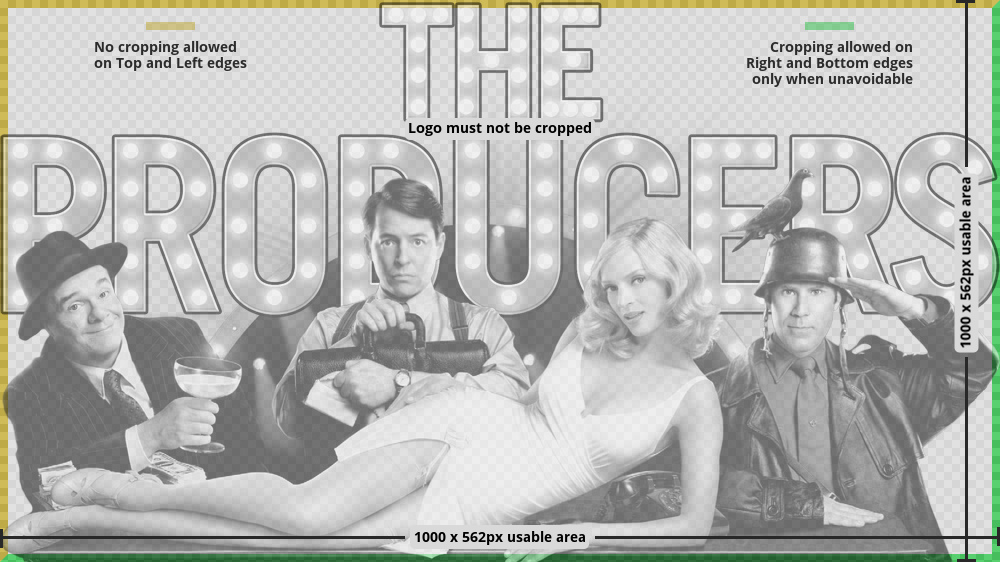

!!! info "Overview"

    - TV Show ClearARTs are images of a tvshow logo/name including characters of the tv show with a transparent background
    - Can be used while browsing your media center library to show next to the poster/banner or as a recognizable navigation item

---

#### **Rules Synopsis**

* Images must be in png format sized 1000x562 pixels, no exceptions.
* Clearart should contain images of character(s) <em>or highly recognizable major items</em> from the series as well as a recognizable series logo.
* Use transparency in areas not filled with characters, logos, etc. If possible remove background elements like buildings.
* Avoid cutting off the sides of characters, never cut off the top of their heads, and do not crop off any part of the logo.
* Most skins align these on the bottom right of the screen so if you have no alternative but to crop a square edge do it on this side. No cropping of any part of the image on the top or left hand sides.
* We will NOT accept clearart with jagged edges or lazy tracing.
* Using glows should be avoided unless it is relevant to the clearart. Any clearart submitted with glows can be denied at moderators discretion.
* A limit of 4 clearart per show/movie per user. No Exceptions.
 
---

---

#### __Other rules and considerations__

??? note "**Similar Images**"  

    - __Each image should be it’s own unique piece of art. __

    - __Do not submit art that is similar to art already on the site, or to your own submissions. __

    - __This includes different zoom levels of the same image, and using different logo combinations with the same images.__

    - __The only exception is the 2 language rule.__
    

??? note "**Languages**"

    - __Each user is limited to creating a piece of art in a maximum of 2 languages.__

    - __The most prominent language in the logo is what determines what language to set.__

    - __If the title of a Movie/TV Show is identical in any country to the title in English, the image MUST be uploaded as English. It is your responsibility to check [imdb](http://www.imdb.com/) or [tvdb](http://thetvdb.com/) before you upload it.__

    English is the default language as well as the fallback language in Media Centers, this will ensure the artwork is available to the widest audience possible. When we move to the new site, we will have an option to set a piece of art to multiple languages which will make this rule obsolete, but until then please observe this rule.

    We really don’t want to swamp our database with a zillion images in every possible language/format that exists. If there is an interest for some art in a language that is not available, it will prompt that user to either create that artwork themselves, or they can use the request system. This way only images that are in demand are getting produced, and we are not filling up our pages with art gathering dust.  
    
    Our goal should be to try and fill in or make artwork where there is none. This is much more helpful to the site. One look at our [Incomplete Section](https://fanart.tv/list-page/) should give plenty of opportunities for people who want to produce a lot of art and want to really help the site at the same time.

??? note "**Clearart Shadows**" 
    - __Do not crop shadows when unnecessary__

    As the rules states, you are allowed to crop on the bottom and right sides of an image. When this shouldn’t be done is when there is no need for it. If you are using a full uncropped image for your clearart, then there is no reason to crop the shadows either. The exception to this is when using perspective shadows that are almost an image unto themselves.  

??? note "**Clearart Canvas**"
    - __Try to use as much of the canvas as possible__

    This one is very subjective but you may get a denial when your clearart doesn’t use up as much space as it could. You should always strive to use as much of the canvas as possible. Sometimes this isn’t easy to do depending on the source you are working with, but it usually just means you need to get a little creative. Usually a mod will give you some pointers on how to achieve this if this happens to you. If not, it might just be an image that doesn’t work very well as a clearart.  

#### __Resources__

??? example "HD ClearArt Templates and Tutorials"

    - [Why Your Artwork May Be Denied](https://fanart.tv/tutorials/artwork-may-denied){target= blank}
    - [Gimp HD ClearArt Template](https://fanart.tv/wp-content/uploads/2021/06/HDClearart-Template_2021.xcf){target= blank}
    - Photoshop HD ClearArt Template
    - [ClearArt Tutorials](https://fanart.tv/type/clearart-2/){target= blank}
