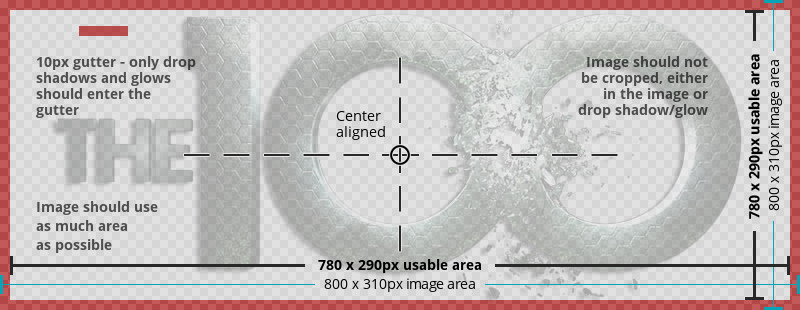

!!! info "Overview"

    - TV Show Logos are images of a tvshow logo/name with a transparent background
    - Can be used while browsing your media center library to show next to the poster/banner or as a recognizable navigation item

---

#### **Rules Synopsis**

* Image Size 800 x 310px
* Centered aligned both vertically and horizontally
* 10px gutter, this means the actual image is a maximum of 780px by 290px and any dropshadow/outerglow can go into the gutter, but the image may not
* Always fill as much width/height as possible
* Logos need to be visible on all kinds of backgrounds
* Try to go with the lighter color version of a logo since 90% of skins are dark
* Logo color should be authentic to the original logo. If the original logo has a dark color, a white version is allowed.
* No taglines, actor, director or studio. Just the title of the show
* A limit of 4 logos per TV show per user. No Exceptions

---

---

#### __Other rules and considerations__

??? note "**Similar Images**"  

    - __Each image should be it’s own unique piece of art. __

    - __Do not submit art that is similar to art already on the site, or to your own submissions. __

    - __This includes different zoom levels of the same image, and using different logo combinations with the same images.__

    - __The only exception is the 2 language rule.__
    

??? note "**Languages**"

    - __Each user is limited to creating a piece of art in a maximum of 2 languages.__

    - __If the title of a Movie/TV Show is identical in any country to the title in English, the image MUST be uploaded as English. It is your responsibility to check [imdb](http://www.imdb.com/) or [tvdb](http://thetvdb.com/) before you upload it.__

    English is the default language as well as the fallback language in Media Centers, this will ensure the artwork is available to the widest audience possible. When we move to the new site, we will have an option to set a piece of art to multiple languages which will make this rule obsolete, but until then please observe this rule.

    We really don’t want to swamp our database with a zillion images in every possible language/format that exists. If there is an interest for some art in a language that is not available, it will prompt that user to either create that artwork themselves, or they can use the request system. This way only images that are in demand are getting produced, and we are not filling up our pages with art gathering dust.  
    
    Our goal should be to try and fill in or make artwork where there is none. This is much more helpful to the site. One look at our [Incomplete Section](https://fanart.tv/list-page/) should give plenty of opportunities for people who want to produce a lot of art and want to really help the site at the same time.