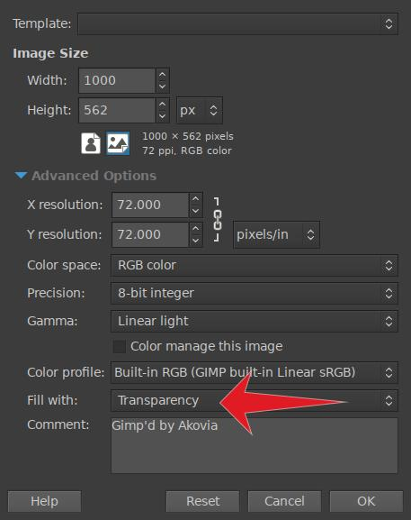
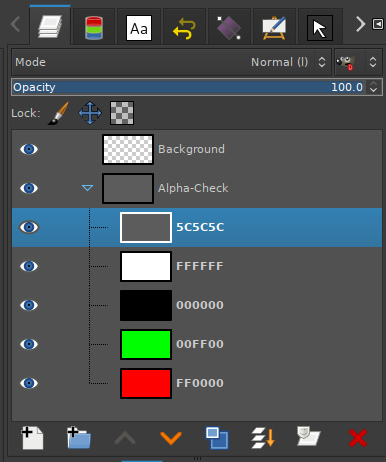
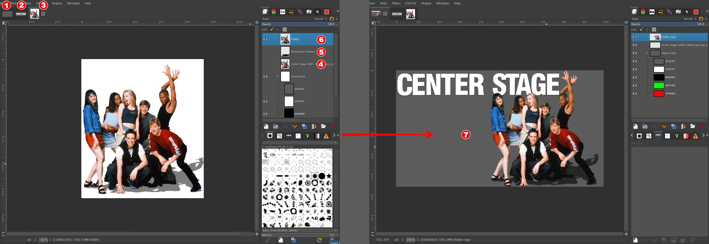
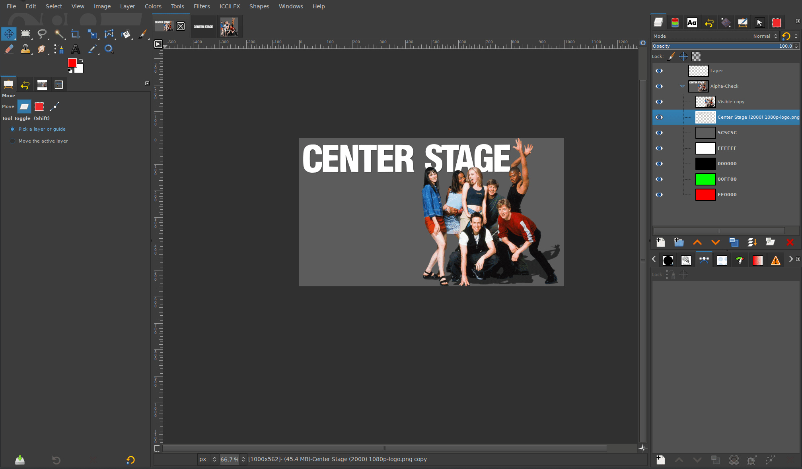
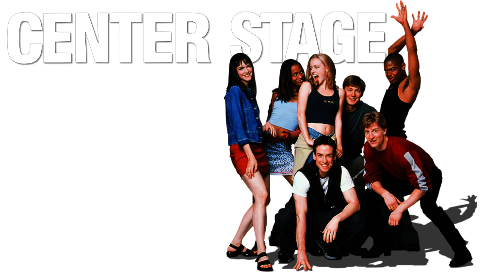

# **Gimp ClearArt Tutorial**

| key                  { .tut-th } | value                 { .tut-th } |
| -------------------------------: | :-------------------------------- |
| **Author**          { .tut-key } | Akovia                            |
| **Date:**           { .tut-key } | April 2022                        |
| **Difficulty:**     { .tut-key } | Beginner                          |
| **Gimp Version:**   { .tut-key } | 2.10.30                           |
| **Estimated Time:** { .tut-key } | 15 Minutes                        |

#### Description:

In this tutorial you will learn how to design a basic ClearArt for use in the Movie and TV Show sections. 

???+ summary "**Requirements:**"

    - [Current version of Gimp](https://www.gimp.org/downloads/){target= blank}
    - [Basic understanding of, and how to navigate around in Gimp.](https://www.gimp.org/tutorials/){target= blank}
    - One clean HDLogo.
    - One Render of a character(s), <em>or highly recognizable major items</em> from the series or movie.
    - **\*Optional:** [Gimp script for creating color background layers.](https://fanart.tv/alpha-check/)

??? Tip "Tips"
    1. Best viewed when using the Imagus Browser Extension for [Chrome](https://chrome.google.com/webstore/detail/imagus/immpkjjlgappgfkkfieppnmlhakdmaab?hl=en) or [Firefox](https://addons.mozilla.org/en-US/firefox/addon/imagus/). This will allow you to view the full sized images without having to leave the page.
    2. If you can't find the command or tool referenced in this tutorial, use [Gimp's built in search tool](https://www.gimp.org/release-notes/gimp-2.10.html#search-system){target= blank} by pressing the **Forward Slash** keyboard shortcut. **`/`**

??? Warning "Relevant Rules"
    
    - [HD Movie Clearart](/ImageTypes/Movies/hdmovieclearart/)
    - [HD TV Clearart](/ImageTypes/TV/hdclearart/)
    - [HD Movie Logo](/ImageTypes/Movies/hdmovielogo/)
    - [HD TV Logo](/ImageTypes/TV/hdtvlogo/)

## **Step 1:** Create Image

We will start by creating a new image with the dimensions of our ClearArt. **(1000px x 562px)** Be sure to fill the background with Transparency.

 `File > New` 

## **Step 2:** Add Background Layers

Create colored background layers to check your clearart against so you will be able to expose issues easily. You can [install](https://docs.gimp.org/en/install-script-fu.html){ target= blank} the the [supplied gimp script](https://fanart.tv/alpha-check/), or just manually create the layers yourself.

??? info "Suggested Background Colors"

    - **#FFFFFF**
    - **#000000**
    - **#5C5C5C**
    - **#00FF00**
    - **#FF0000** 
  
The script will put them in a layer group to make them easier to work with, but it's not necessary if adding the layers manually.

## **Step 3:** Layout Elements

Now we can take our render and logo and place them on the canvas. The key considerations to a successful clearart that will pass moderation are ...

- Use high quality renders and logos.
- Use as much of the canvas as possible.
- Do not crop on the [top](/General/why denied/#cropped-on-top) or the [left](/General/why denied/#cropped-on-left).

The easiest way to start would be to add any effects or shadows to your render at full size, then size everything down to fit within the ClearArt canvas. Make sure you have your [aspect ratio locked when resizing](https://www.gimp.org/tutorials/GIMP_Quickies/#changing-the-size-dimensions-of-an-image-scale){target= blank} as we do not accept images that have been [stretched or squished](/General/why%20denied/#aspect-ratio) to fit.

In the left image below I prepped my work, then brought it together in the right image.

1. I have the blank ClearArt canvas I prepared in [Step 1](#step-1-create-image).
2. I opened the logo I will be using.
3. This is the render I am using.
4. This layer has the raw render that has already been checked and is ready to be used.
5. This layer is the [perspective shadow](https://docs.gimp.org/2.10/en/script-fu-perspective-shadow.html){target= blank} I added to give the image some depth.
6. This is layer is a composite of the render and the perspective shadow combined.
7. I trimmed the logo and render images using [crop to content](https://docs.gimp.org/en/gimp-image-crop.html){target= blank} to remove any surrounding space. Then I just dragged each image over to my blank clearart canvas for placement.

The logo was designed for the site so the size was good enough to use as is. You want to avoid enlarging any images which will decrease the quality.

The render was larger than the canvas, so I scaled the layer to make it as large as possible without cropping it. In this case I made it 562px tall. Adding the shadow before resizing made it possible to not worry about the shadow getting cropped.

<figure><figcaption><a href="../../../assets/images/tutorial-assets/gimp-clearart-prep-render-2-layout.jpg">Full-Size Image Link</a></figcaption></figure>

 **Hover image below to see the pieces put together.** 

<figure><figcaption><a href="../../../assets/images/tutorial-assets/gimp-clearart-crop-n-drag.gif">Full-Size Image Link</a></figcaption></figure>

 **... and the finished ClearArt** 

??? Tip "Tip"

    If your skills are not yet up to the level required by the site to create your own renders, you might be able to find a render that's already been done and is free to use. Adding some or all of the following terms to your image search might turn up a result you can use.
    
    `cutout` `png` `renders` `transparent background`

    _\*You will still need to verify the image meets our requirements._

??? info "Related Tutorials"

    [Gimp from Scratch pt5](https://www.youtube.com/watch?v=N1B0TpyZ0vs&list=PLDS30vesSUNHXwUEy7EbIRxJlLB0ox7H7){target= blank}

    This tutorial is pretty old now, but the tools and techniques are still very relevant. This tutorial goes over a basic image render, and constructing a ClearArt using that render.

--8<-- "includes/abbreviations.md"

